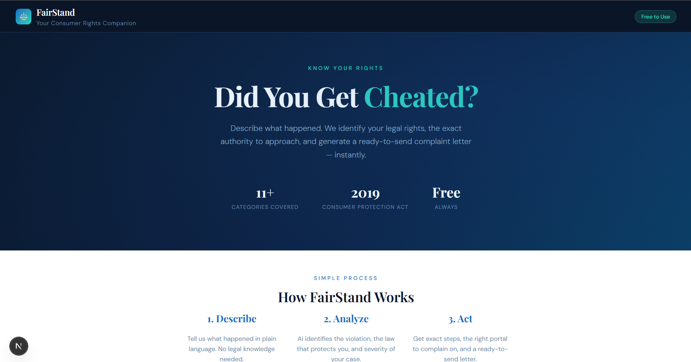
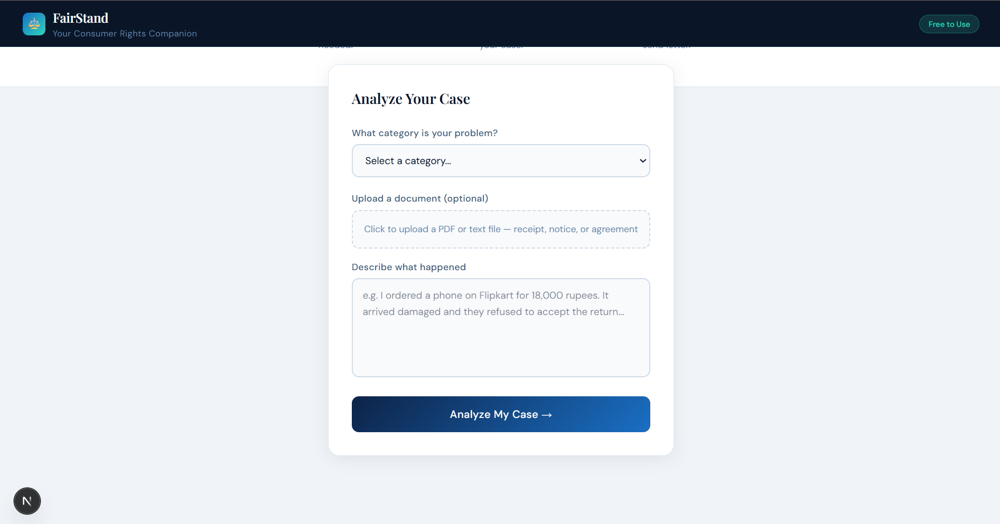
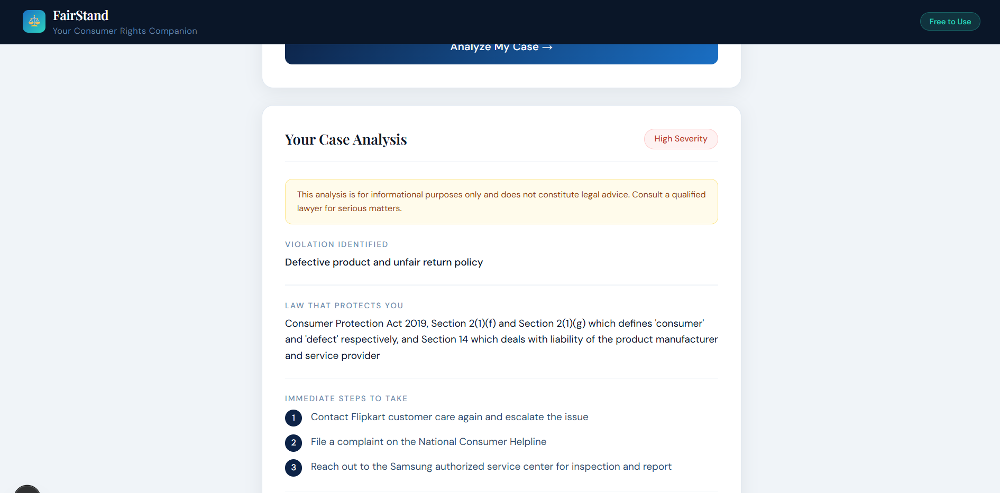
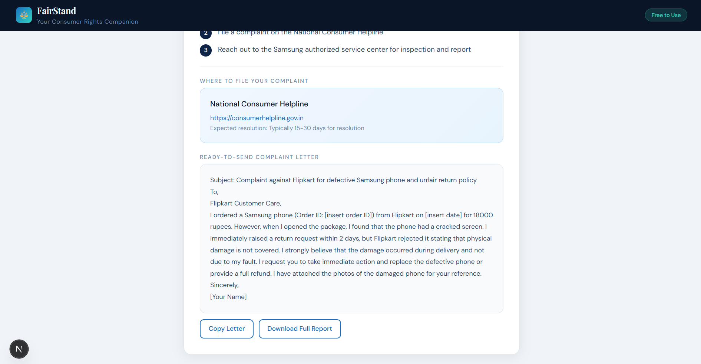

# FairStand — Consumer Rights AI

FairStand is an AI-powered web app that helps ordinary Indians understand their consumer rights and take action when cheated by a business. Describe your situation in plain language and instantly get the law that protects you, steps to take, the right portal to complain on, and a ready-to-send complaint letter.

🔗 **Live Demo:** https://consumer-rights-ai-846w.vercel.app

---

## Screenshots

### Form



### Result



---

## The Problem

Most people don't know their consumer rights. Even if they do, filing a complaint feels impossible — which form, which authority, what to write. So people absorb the loss. FairStand fixes that.

---

## Features

- Analyzes your situation and identifies the legal violation
- Cites the exact law that protects you (Consumer Protection Act 2019, RBI, IRDAI, RERA)
- Gives immediate action steps
- Links you to the right grievance portal
- Generates a ready-to-send complaint letter instantly
- Covers 11 categories — e-commerce, banking, insurance, telecom, healthcare, and more

---

## Tech Stack

- **Frontend & Backend** — Next.js 15 (App Router)
- **AI** — Groq API with Llama 3.3 70B
- **Styling** — Tailwind CSS + custom CSS
- **Deployment** — Vercel

---

## Getting Started

```bash
git clone https://github.com/abhiishek-as/consumer-rights-ai
cd consumer-rights-ai
npm install
```

Create a `.env.local` file:

---

## How It Works

1. **Describe** — User explains what happened in plain language
2. **Analyze** — AI identifies the violation, applicable law, and severity
3. **Act** — User gets exact steps, portal link, and a complaint letter ready to send

---

## Categories Covered

E-commerce, Banking & Finance, Insurance, Real Estate, Healthcare, Telecom, Food & Restaurant, Education, Employment, Government Services

---

Built by [Abhishek AS]